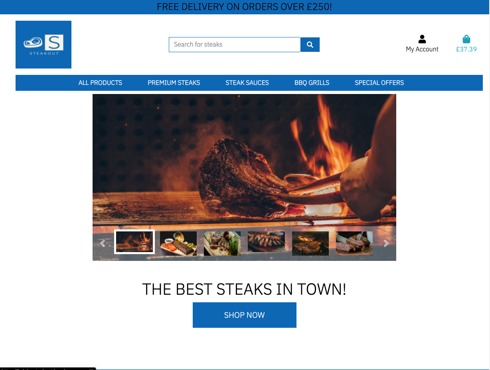

# E-Commerce Store

## Introduction

Welcome to my fifth project. This project is an e-commerce store for steak lovers. Users will be able to purchase steaks and steak related equipment from this website. This project will use languages and frameworks such as Django, Python, HTML, CSS and JavaScript.

In this project I will set up an authentication mechanism and provide access to the site's data for users to purchase a range of products.

The admin of the website will also be have the ability to use all CRUD funtionality (Create, Read, Update, Delete).

A live website can be found [here](https://kelvin-steakout.herokuapp.com/).


# Table of Contents

-   [1. UX](#ux)
    -   [1.1. Strategy](#strategy)
        -   [Project Goals](#project-goals)
            -   [User Goals:](#user-goals)
            -   [User Expectations:](#user-expectations)
            -   [Trends of Modern Websites](#trends-of-modern-websites)
            -   [Strategy Table](#strategy-table)
    -   [1.2. Structure](#structure)
    -   [1.3. Skeleton](#skeleton)
    -   [1.4. Surface](#surface)
-   [2. Features](#features)
-   [3. Technologies Used](#technologies-used)
-   [4. Testing](#testing)
-   [5. Deployment](#deployment)
-   [6. SEO](#seo)
-   [7. Marketing](#marketing)
-   [8. Social Media](#social-media)
-   [9. End Product](#end-product)
-   [10. Known Bugs](#known-bugs)
-   [11. Credits](#credits)

<a name="ux"></a>

# 1. UX

[Go to the top](#table-of-contents)

As a massive fan of steak, I have always experimented with buying steaks online. There are multiple methods that I use when purchasing steaks. The main method I use is ordering from a website. I can clearly identify which cut of steak I would like. This store will mainly focus on simplicity and user experience for the customers.

This project will showcase a range of steaks and steak related products for customers to purchase. The site will be clear and easilsy accessible. The best e-commerce stores display simply but clear navgiation around the site, with an intuitive design.

<a name="strategy"></a>

## 1.1. Strategy

[Go to the top](#table-of-contents)

### Project Goals
One of the main goals of the project is to create a simple and intuitive store where customers can purchase steaks and steak related items. Products will be presented in a elegant and easy view. All site users will be able to navigate around the website clearly.

### User Goals:
First Time Visitor Goals
-   As a first-time visitor, I want to be able to view a list of products so that I can select some to purchase
-   As a first-time visitor, I want to view a specific category of products so that I can quickly find products I'm interested in without having to search through all products.
-   As a first-time visitor, I want to quickly identify deals so that I can take advantage of special savings on products I'd like to purchase.
-   As a first-time visitor, I want to search for a product key by name or description so that I can find a specific product I'd like to purchase.
-   As a first-time visitor, I want to view individual product details so that I can identify the price, description, product rating, product image and available sizes/weights.
-   As a first-time visitor, I want to easily view the total of my purchases at any time so that I can avoid spending too much.
-   As a first-time visitor, I want to sort the list of available products so that I can easily identify the best rated, best priced and categorically sorted products.
-   As a first-time visitor, I want to sort a specific category of products so that I can find the best-priced or best-rated products in a specific category, or sort the products in that category by name.
-   As a first-time visitor, I want to easily add items to my basket so that I can view all the products I would like to purchase before completing payment.
-   As a first-time visitor, I want to easily remove items and update quantities from my basket so that I can remove any products I do not want before checking out.
-   As a first-time visitor, I want to easily select the size/weight and quantity of a product when purchasing it so that I can ensure I don’t accidentally select the wrong product, quantity or size/weight.
-   As a first-time visitor, I want to easily enter my payment information at the checkout page so that I can checkout with no hassles.
-   As a first-time visitor, I want to feel safe and secure with my personal and payment information so that I can confidently provide the details to make a purchase.
-   As a first-time visitor, I want to be able to checkout as a guest.

Returning Visitor Goals
-   As a returning visitor, I want to create an account.
-   As a returning visitor, I want to update my user profile.
-   As a returning visitor, I want to view my order history.
-   As a returning visitor, I want to easily login or logout so that I can access my personal account information.
-   As a returning visitor, I want to easily register for an account so that I can have a personal account and be able to view my profile.


Frequent User Goals
-   As a frequent user, I want to read up on the latest blog posts.

### User Expectations:
The website should have a simple user interface, with the navigation to each section clear and concise.

-   The menu is clear to read.
-   The user interface is easy to navigate.
-   The website is responsive on all devices.
-   To be able to see a clear selection of products.
-   Easily view the total of the basket before making any payment.
-   The website provides responsive feedback for any actions, for example when adding a product to the basket.

### User Stories
Throughout the project I used the GitHub projects board to log all user stories as my project management tool. This helped me keep focus on the necesarry tasks as I would move them to the "in progress lane" as I'm working on the story. I would then move them to the "done" lane once the story has been completed.

![user_story_board](

### Strategy Table
Opportunity/Problem/Feature| Importance| Viability/Feasibility
------------ | -------------------------|---------
Ability to search for products | 5 | 5
Account signup | 5 | 5
User profile | 5 | 5
Responsive design | 5 | 5
Contact form | 4 | 5
Ability to add products to the basket | 5 | 5
Ability to make payment for the selected products | 5 | 5
Ability to rate products | 5 | 4
To view blog posts | 5 | 4
Filters on the products page | 3 | 2
Subscription based items | 2 | 1

Total | 49 | 46

## Scope
As I am unable to include all of the features from the strategy table. I will phase this project in multiple phases. Phase 1 will be what I have identified as a minimum viable product. Please find below the plans I have for each phase.

### Phase 1
- Display a range of steak related products
- Allow users to register for an account
- Allow users to create and edit a personal profile
- Responsive design
- Contact form
- Ability to add/edit/delete products
- Ability to add/edit/blog posts
- Ability to subscribe and unsubscribe to a newsletter form
- Allow the customer to enter payment information secrurely
- Provide different weights of steaks

### Phase 2
- Add other steak realted products
- Add ability for superusers to send our emails to newsletter subscribers
- Adjust the price according to the weight selected
- FAQs page
- Add ability for users to rate and review products
- Filter the steak category by the cut of beef

<a name="structure"></a>

## 1.2. Structure

[Go to the top](#table-of-contents)

It is really important to include responsive design in this project as many users are using different devices (mobile, tablet, laptop/PC). This gives the user the best experience on their device.

- Responsive on all device sizes
- Easy navigation through labelled buttons
- Footer at the bottom of the each page that links to the social media websites, newsletter subscription form and business pages.
- All elements will be consistent including font size, font family, colour scheme.

### Database Model
Blog model structure:

```python
class Post(models.Model):
    """
    Blog post model
    """
    title = models.CharField(max_length=254)
    slug = models.SlugField(max_length=254, unique=True)
    excerpt = models.TextField(blank=True)
    content = models.TextField()
    created_on = models.DateTimeField(auto_now_add=True)
    author = models.ForeignKey(
        User, on_delete=models.CASCADE, related_name="blog_posts"
    )
    status = models.IntegerField(choices=STATUS, default=0)
    image_url = models.URLField(max_length=1024, null=True, blank=True)
    image = models.ImageField(null=True, blank=True)

    class Meta:
        ordering = ['-status', '-created_on']

    def __str__(self):
        return self.title
```

Checkout model structure:

```python
class Order(models.Model):
    """
    A model for the customer order
    """

    order_number = models.CharField(max_length=32, null=False, editable=False)
    user_profile = models.ForeignKey(
        UserProfile, on_delete=models.SET_NULL, null=True, blank=True,
        related_name='orders')
    full_name = models.CharField(max_length=50, null=False, blank=False)
    email = models.EmailField(max_length=254, null=False, blank=False)
    phone_number = models.CharField(max_length=20, null=False, blank=False)
    country = CountryField(blank_label="Country *", null=False, blank=False)
    postcode = models.CharField(max_length=20, null=True, blank=True)
    town_or_city = models.CharField(max_length=40, null=False, blank=False)
    street_address_1 = models.CharField(max_length=80, null=False, blank=False)
    street_address_2 = models.CharField(max_length=80, null=True, blank=True)
    county = models.CharField(max_length=80, null=True, blank=True)
    date = models.DateTimeField(auto_now=True)
    delivery_cost = models.DecimalField(
        max_digits=6, decimal_places=2, null=False, default=0)
    order_total = models.DecimalField(
        max_digits=10, decimal_places=2, null=False, default=0)
    grand_total = models.DecimalField(
        max_digits=10, decimal_places=2, null=False, default=0)
    original_bag = models.TextField(null=False, blank=False, default='')
    stripe_pid = models.CharField(
        max_length=254, null=False, blank=False, default='')

    def _generate_order_number(self):
        """ Generates a random, unique order number """
        return uuid.uuid4().hex.upper()

    def update_total(self):
        """
        Update the grand total each time a line item is added,
        accounting for delivery costs
        """
        self.order_total = self.lineitems.aggregate(
            Sum('lineitem_total'))['lineitem_total__sum'] or 0
        if self.order_total < settings.FREE_DELIVERY_THRESHOLD:
            self.delivery_cost = self.order_total * settings.STANDARD_DELIVERY_PERCENTAGE / 100
        else:
            self.delivery_cost = 0
        self.grand_total = self.order_total + self.delivery_cost
        self.save()

    def save(self, *args, **kwargs):
        """
        Orverride the original save method to set the order number
        if it hasn't already been set
        """
        if not self.order_number:
            self.order_number = self._generate_order_number()
        super().save(*args, **kwargs)

    def __str__(self):
        return self.order_number


class OrderLineItem(models.Model):
    order = models.ForeignKey(
        Order, on_delete=models.CASCADE, null=False, blank=False,
        related_name='lineitems')
    product = models.ForeignKey(
        Product, on_delete=models.CASCADE, null=False, blank=False)
    product_weight = models.CharField(max_length=5, null=True, blank=True)
    quantity = models.IntegerField(null=False, blank=False, default=0)
    lineitem_total = models.DecimalField(
        max_digits=6, decimal_places=2, null=False, blank=False,
        editable=False)

    def save(self, *args, **kwargs):
        """
        Orverride the original save method to set the lineitem total
        and update the order total
        """
        self.lineitem_total = self.product.price * self.quantity
        super().save(*args, **kwargs)

    def __str__(self):
        return f'SKU {self.product.sku} on order {self.order.order_number}'
```

Customer model structure:

```python
class CustomerContact(models.Model):
    """ A Model for the customer contact form """

    full_name = models.CharField(max_length=254, null=False, blank=False)
    email = models.EmailField(max_length=254, null=False, blank=False)
    subject = models.CharField(max_length=50, null=False, blank=False)
    message = models.TextField(max_length=254, null=False, blank=False)


class NewletterSubscriber(models.Model):
    """ A Model for the customer newsletter subscription form """

    email = models.EmailField(max_length=254, null=False, blank=False)
    date = models.DateTimeField(auto_now_add=True)

    def __str__(self):
        return self.email
```

Products model structure:

```python
class Category(models.Model):

    class Meta:
        verbose_name_plural = 'Categories'

    name = models.CharField(max_length=254)
    friendly_name = models.CharField(max_length=254, null=True, blank=True)

    def __str__(self):
        return self.name

    def get_friendly_name(self):
        return self.friendly_name


class Product(models.Model):
    category = models.ForeignKey(
        'Category', null=True, blank=True, on_delete=models.SET_NULL)
    sku = models.CharField(max_length=254, null=True, blank=True)
    name = models.CharField(max_length=254)
    description = models.TextField()
    has_weight = models.BooleanField(default=False, null=True, blank=True)
    price = models.DecimalField(max_digits=6, decimal_places=2)
    rating = models.DecimalField(
        max_digits=6, decimal_places=2, null=True, blank=True)
    image_url = models.URLField(max_length=1024, null=True, blank=True)
    image = models.ImageField(null=True, blank=True)

    def __str__(self):
        return self.name
```

User Profile model structure:

```python
class UserProfile(models.Model):
    user = models.OneToOneField(User, on_delete=models.CASCADE)
    default_phone_number = models.CharField(
        max_length=20, null=True, blank=True)
    default_street_address_1 = models.CharField(
        max_length=80, null=True, blank=True)
    default_street_address_2 = models.CharField(
        max_length=80, null=True, blank=True)
    default_town_or_city = models.CharField(
        max_length=40, null=True, blank=True)
    default_postcode = models.CharField(
        max_length=20, null=True, blank=True)
    default_county = models.CharField(
        max_length=80, null=True, blank=True)
    default_country = CountryField(
        blank_label="Country", null=True, blank=True)

    def __str__(self):
        return self.user.email


@receiver(post_save, sender=User)
def create_or_update_user_profile(sender, instance, created, **kwargs):
    """vCreate or update the user profile """
    if created:
        UserProfile.objects.create(user=instance)
    instance.userprofile.save()
```

<a name="skeleton"></a>

## 1.3. Skeleton

[Go to the top](#table-of-contents)

### Wire-frames

Home/Landing Page Desktop:


Sign Up Page Desktop:


Sign In Page Desktop:


Products Desktop:


Product Details Desktop:


Shopping Bag Desktop:


Checkout Desktop:


Contact Desktop:


From left to right Home > Sign Up > Sign In Mobile:


From left to right Products > Product Details > Shopping Bag Mobile:


From left to right Checkout > Contact Mobile:


<a name="surface"></a>

## 1.4. Surface

[Go to the top](#table-of-contents)

### Colours
Please find the colours schemes that I used [here](https://coolors.co/007bff-000000-ffffff).

### Typography

I decided to use IBM Plex Sans Arabic as my font of choice with sans serif as my backup font for browsers that might not support IBM Plex Sans Arabic.

The link to the font can be found [here](https://fonts.google.com/specimen/IBM+Plex+Sans+Arabic).


<a name="features"></a>

# 2. Features

[Go to the top](#table-of-contents)

### All Pages

- The navigation bar is placed at the top of all pages. This contains 2 sections that are separated out. The first section being the product search bar, my account icon and the basket icon. The second section contains the main navigation for the products. The navigation bar is dynamic in that meaning depending on if the user is logged in or not the options will change.
- If the user is not logged in the navigation bar will look like this:

- If the user is logged in the navigation bar will look like this:

- If the user is logged in as a superuser the navigation bar will look like this:

- As a superuser, the admin will have access to the product management and blog management links.


- The footer is placed at the bottom of each page with social media icons, a form to subsribe to the newsletter, a link to unsubscribe to the newsletter and useful business related links. All links in the footer open the links in a new tab.
- The business logo is also placed at the top of all pages. Clicking on it will also direct the user to the home page.

### Sign Up Page
- A simple signup form that requires the user to enter a unique email address and a password. The password must be entered again for confirmation, this must match the already entered password above.
- A message to prompt the user that if an account is already been created they can click the sign-in hyperlink to be redirected to the sign-in page.
- If the user enters an email address that has already been registered, the user is prompted by an error message.

- If the user enters a password that is not secure, the user will be prompted by a message.

- If the user enters both passwords that do not match, the user is prompted by a message.

- If the user does not enter a email address the form will show a validation error, prompting the user to enter the field in an email format.

- Once the user has successfully signed up, this will send the user a email to confirm activativation of their account.

### Login Page
- A login form that requires the user to enter their email address and password that they used when signing up to the site.
- The user can only login once they have activated their account via an email recieved after signing up.
- A message to prompt the user that if an account has not been created they can click the signup hyperlink to be redirected to the signup page.
- If the user enters in the wrong credentials, a message is displayed to the user.

- Once the user has successfully logged in, they will be redirected to the home page. A success message will show to confirm the login has been successful.


### Logout Page
- When clicking logout from the navigation bar, the user is redirected to a sign-out page to confirm their action.

### Landing Page
- A carousel that displays what the user can expect from this store.
- A shop now button that directs the user to all products page. The user can then easily identify products they would like to purchase and add them to the basket.

### Products Page
- The user can access the product pages by selecting the category on the navigation bar.
- The page displays a count of the search results within the category.
- Sort by filter at the top right of the page, so the user can filter by price, rating, name and category.
- Each product has an image, name of product, price, category and rating.
- The page also contains a back to top button, where the user can click this to go to the top of the page.
- As a superuser, the admin can see the edit and delete buttons, allowing quick access to the product admin.

### Products Details Page
- The product details will showcase an image, name of product, short description, price, weight selector(if the product has different weights), category and rating, quantity selector, keep shopping button and a add to basket button.
- As a superuser, the admin can see the edit and delete buttons, allowing quick access to the product admin.
- The quantity selector starts off at 1. When the quantity is at 1, the minus button is disabled.
- When adding a product to the basket, the user will be prompted with a success message confirming the product has been added.


### Basket Page
- This page shows each product as a line item, displaying an image, name of product, weight, SKU, price per item, quantity selected, quantity selector to update and a subtotal for each item.
- When the quantity selector is at 1, the minus button is disabled.
- A pricing summary of the whole basket is also shown with the basket total, delivery fee and grand total.
- If the use has not met free delivery threshold then an alert message is shown, prompting the user that they can qualify for free delivery if they spend more.


### Checkout Page
- A checkout form, prompting the user to enter their delivery details with Stripe integration.
- A checkbox for the user to confirm if they would like to save their details for next time. This only saves delivery details and no the card details.
- A summary of the users order is also shown, the user can then be sure they are making the correct purchase before continuing with the checkout process.
- A message is shown just below the complete order button to warn the user that they will be charged a certain amount on their card.

### Checkout Success Page
- This page shows a summary of their order, with an order number.
- Once the user is at this page, an email will also be triggered to send out a order confirmation email.

### My Profile Page
- This page shows a form so the user can update their delivery details. Upon completing of the form, all delivery details will be updated if the user proceeds to the checkout page again.
- Order history is also displayed, where the user can select the order number to view a previous order confirmation summary. An alert will also show prompting the user they are viewing a past order confirmation summary.


### Product Management Page
- This page is for superusers only.
- A form to add more products to the store.

### Blog Management Page
- This page is for superusers only.
- A form to add more blog posts.

### Newsletter Subscribe Page
- A one field form for the user to enter their email to subscribe to the newsletter.
- Once the user has successlly subscribed to the newsletter, they will be redirected to the home page. A success message will show up confirming the user has successfully subscribed to the newsletter.
- If the user has already subscribed, an error message will show up.


### Newsletter Unsubscribe Page
- A one field form for the user to enter their email to unsubscribe from the newsletter.
- Once the user has successlly unsubscribed from the newsletter, they will be redirected to the home page. A success message will show up confirming the user has successfully unsubscribed to the newsletter.
- If the user enters an email address that is not subscribed to the newsletter, a message will be displayed to the user.


<a name="technologies-used"></a>

## 3. Technologies Used

[Go to the top](#table-of-contents)

-   [HTML5](https://en.wikipedia.org/wiki/HTML)
    -   The project uses HyperText Markup Language.
-   [CSS3](https://en.wikipedia.org/wiki/CSS)
    -   The project uses Cascading Style Sheets.
-   [JavaScript](https://en.wikipedia.org/wiki/JavaScript)
    -   The project uses JavaScript.
-   [Python](https://en.wikipedia.org/wiki/Python_(programming_language))
    -   The project uses Python.
-   [Django](https://www.djangoproject.com/)
    -   The project uses Django as the main framework.
-   [Boostrap 4](https://getbootstrap.com/docs/4.0/getting-started/introduction/)
    -   The project uses Bootstrap 4.
-   [PostgreSQL](https://www.postgresql.org/)
    -   The project uses PostgreSQL as a database.
-   [AWS](https://aws.amazon.com/)
    -   The project uses Amazon Web Services to host all static and media files.
-   [Gitpod](https://www.gitpod.io/)
    -   The project uses Gitpod.
-   [Chrome](https://www.google.com/intl/en_uk/chrome/)
    -   The project uses Chrome to debug and test the source code using HTML5.
-   [Heroku](https://www.heroku.com/)
    -   The project is deployed and hosted by Heroku.
-   [Balsamiq](https://balsamiq.com/)
    -   Balsamiq was used to create the wireframes during the design process.
-   [Google Fonts](https://fonts.google.com/)
    -   Google fonts were used to import the "Be Vietnam Pro" font into the style.css file which is used on all pages throughout the project.
-   [GitHub](https://github.com/)
    -   GitHub was used to store the project's code after being pushed from Git.

<a name="testing"></a>

# 4. Testing

[Go to the top](#table-of-contents)
### Responsive Tools
I used [Am I Responsive](http://ami.responsivedesign.is) to make sure that all my pages are responsive to all devices.

### W3C Validator Tools

#### HTML:
I used [W3C Markup](https://validator.w3.org/#validate_by_input+with_options) to check for any errors within the HTML pages.

I had ocurring errors that were related to Django, for these instances I have chosen to ignore them.


#### CSS:
I used [W3C CSS Validation](https://jigsaw.w3.org/css-validator/) to check for any errors within all my CSS stylesheets.

I had one error in my checkout CSS file, however, I have chosen to ignore this as this code is similar to the Code Institute CSS:


I had no errors in my root level CSS file:


### JavaScript:
I used [JS Hint](https://jshint.com/) to check for any errors within all my JavaScript script files. JS Hint showed warnings a few warnings but no errors.

I had no errors in my JavaScript files:


### Python:
I used the python3 -m flake8 command within GitPod to check for any errors within my Python files. The validator showed multiple "line too long" errors. This was rectified by adding each statement as a new line.

There were also "line too long" errors within my settings.py file but I have chosen to ignore these as this is a very important file.

## Manual Testing

I have tested my site on Safari and google chrome on multiple devices.

These include:
-   iPhone X
-   iPhone XS Max
-   iPad Pro
-   MacBook Pro

Please find below my testing process for all pages via mobile and web:

### Navigation Bar

All Pages:
TEST            | OUTCOME                          | PASS / FAIL  
--------------- | -------------------------------- | ---------------
Home page | When clicking the "home" link in the navigation bar (mobile only) or on the business logo, the browser redirects me to the home page. | PASS
All products page | When clicking the "All Products" link in the navigation bar, the category shows a dropdown list so I have access to more sort/filter options. The user will know they are on this page by the heading. | PASS
Premium steaks page | When clicking the "Premium Steaks" link in the navigation bar, the browser redirects me to the premium steaks product page. The user will know they are on this page by the heading. | PASS
Steak sauces page | When clicking the "Steak Sauces" link in the navigation bar, the browser redirects me to the steak sauces product page. The user will know they are on this page by the heading. | PASS
BBQ grills page | When clicking the "BBQ grills" link in the navigation bar, the browser redirects me to the BBQ grills product page. The user will know they are on this page by the heading. | PASS
Special offers page | When clicking the "Special Offers" link in the navigation bar, the category shows a dropdown list so I have access to more sort/filter options. | PASS
Register page | When clicking the "register" link in the navigation bar, the browser redirects me to the register page. The user will know they are on this page by the heading. | PASS
Login / Logout page | When clicking the "login" or "logout links in the navigation bar, the browser redirects me to the login or logout page. | PASS
Basket page | When clicking the "basket" icon in the navigation bar, the browser redirects me to the basket page. The user will know they are on this page by the heading. | PASS
My Profile page | When clicking the "My profile" link in the navigation bar, the browser redirects me to the my profile page. The user will know they are on this page by the heading. | PASS
Product management page | When clicking the "product management" link as a superuser in the navigation bar, the browser redirects me to the product management page. The user will know they are on this page by the heading. | PASS
Blog management page | When clicking the "blog management" link as a superuser in the navigation bar, the browser redirects me to the blog management page. The user will know they are on this page by the heading. | PASS
Search bar | When searching for a keyword, the results will show products that contain the keyword in the product name or description. | PASS
Foreground & background colour | Checked foreground information is not distracted by background elements. | PASS
Text | Checked that all fonts and colours used are consistent. | PASS


### Footer

All Pages:
TEST            | OUTCOME                          | PASS / FAIL  
--------------- | -------------------------------- | ---------------
Subscribe to newsletter | When filling out the newsletter form in the navigation bar from the footer, the browser redirects me to the home page if the form was completed successfully. The web page also shows me a success message. | PASS
Unsubscribe to newsletter page | When clicking the "unsubscribe" link in the footer, the browser redirects me to the newsletter unsubscribe page. The user will know they are on this page by the heading. | PASS
Contact Us page | When clicking the "contact us" link in the footer, the browser redirects me to the contact page. The user will know they are on this page by the heading. | PASS
Register page | When clicking the "Register" link in the footer, the browser redirects me to the register page. The user will know they are on this page by the heading.| PASS
Login page | When clicking the "login" link in the footer, the browser redirects me to the login page. | PASS
Privacy policy page | When clicking the "Privacy policy" link in the footer, the browser redirects me to the privacy policy page. The user will know they are on this page by the heading. | PASS
Facebook | When clicking the Facebook icon, a new tab opens and redirects to the Facebook website. | PASS
Twitter | When clicking the Twitter icon, a new tab opens and redirects to the Twitter website. | PASS
Instagram | When clicking the Instagram icon, a new tab opens and redirects to the Instagram website. | PASS

### Home page
TEST            | OUTCOME                          | PASS / FAIL  
--------------- | -------------------------------- | ---------------
Media | All media assets are displayed properly, have no pixelation or stretched images and is responsive on all devices. | PASS
Responsiveness | Check every element on the page for consistent scalability in mobile, tablet and desktop view.| PASS

### Products page
TEST            | OUTCOME                          | PASS / FAIL  
--------------- | -------------------------------- | ---------------
Media | All media assets are displayed properly, have no pixelation or stretched images and is responsive on all devices. | PASS
Responsiveness | Check every element on the page for consistent scalability in mobile, tablet and desktop view.| PASS
Sort filter | Check the sort/filter functionality by selecting each option. Each option reloads the page and sorts the products in the corresponding order. | PASS
Edit Button (SuperUser only) | Check the edit button is only accessible if the user is logged in as a SuperUser. | PASS
Delete Button (SuperUser only) | Check the delete button is only accessible if the user is logged in as a SuperUser. | PASS

### Products details page
TEST            | OUTCOME                          | PASS / FAIL  
--------------- | -------------------------------- | ---------------
Media | All media assets are displayed properly, have no pixelation or stretched images and is responsive on all devices. | PASS
Responsiveness | Check every element on the page for consistent scalability in mobile, tablet and desktop view.| PASS
Weight selector | Check the weight selector functionality by selecting each option. Adding each option to the basket to confirm the correct weight is selected. | PASS
Quantity Selector | Check the quantity selector functionality by selecting min and plus buttons where applicable. Adding a product to the basket to confirm the correct quantity selected is correct. | PASS
Edit Button (SuperUser only) | Check the edit button is only accessible if the user is logged in as a SuperUser. | PASS
Delete Button (SuperUser only) | Check the delete button is only accessible if the user is logged in as a SuperUser. | PASS

### Shopping bag page
TEST            | OUTCOME                          | PASS / FAIL  
--------------- | -------------------------------- | ---------------
Media | All media assets are displayed properly, have no pixelation or stretched images and is responsive on all devices. | PASS
Responsiveness | Check every element on the page for consistent scalability in mobile, tablet and desktop view.| PASS
Remove item from bag | Clicking the remove link on an item removes the item from the bag. | PASS
Quantity Selector | Check the quantity selector functionality by selecting min and plus buttons where applicable. Adding a product to the basket to confirm the correct quantity selected is correct. | PASS
Free delivery threshold | Adding products to the bag where the grand total value is under £250, the bag shows the free delivery warning message. The message dissappears when the grand total is over £250. | PASS

### Checkout page
TEST            | OUTCOME                          | PASS / FAIL  
--------------- | -------------------------------- | ---------------
Media | All media assets are displayed properly, have no pixelation or stretched images and is responsive on all devices. | PASS
Responsiveness | Check every element on the page for consistent scalability in mobile, tablet and desktop view.| PASS
Checkout form | Filling in the form with the correct validation processes the order. | PASS
Checkout form | Filling in the form with the incorrect validation shows errors messages. | PASS
Save details checkout | Selecting the "Save this delivery information to my profile" checkbox, this saves/updates my profile details. | PASS

### Checkout success page
TEST            | OUTCOME                          | PASS / FAIL  
--------------- | -------------------------------- | ---------------
Responsiveness | Check every element on the page for consistent scalability in mobile, tablet and desktop view.| PASS
Order history | When clicking on an order number in the order history section, this takes me to a past order confirmation summary page. | PASS
Updating my profile | When updating the default delivery information, this reflects on the checkout page. | PASS

### Product management page
TEST            | OUTCOME                          | PASS / FAIL  
--------------- | -------------------------------- | ---------------
Responsiveness | Check every element on the page for consistent scalability in mobile, tablet and desktop view.| PASS
Adding a product | When filling out the form to add a new product, the product is added to the relevant category and is searchable via the search bar. | PASS
Uploading an image | When uploading an image to a new product, the site shows the name of the file that will be uploaded. When checking the product details page, the image also shows. | PASS

### Blog management page
TEST            | OUTCOME                          | PASS / FAIL  
--------------- | -------------------------------- | ---------------
Responsiveness | Check every element on the page for consistent scalability in mobile, tablet and desktop view.| PASS
Adding a Blog post | When filling out the form to add a blog post, the blog post is added to blog main blog section. | PASS
Uploading an image | When uploading an image to a blog post, the site shows the name of the file that will be uploaded. When checking the all blog posts page, the image also shows. | PASS

<a name="deployment"></a>

# 5. Deployment
[Go to the top](#table-of-contents)

I used the terminal to deploy my project locally. To do this I had to:

1. Create a repository on GitHub.
2. Clone the repository on your chosen source code editor (GitPod in my case) using the clone link.
3. Open the terminal within GitPod
4. Enter "python3 manage.py runserver into the terminal.
5. Go to local host address on my web browser.
6. All locally saved changes will show up here.

<a name="seo"></a>

# 6. SEO
[Go to the top](#table-of-contents)

To improve the SearchEngineOptimisation (SEO) of the site I:

- Added keywords in a meta tag to my base.html. The keywords were researched using [WordTracker](https://www.wordtracker.com/), there are a number of short-tail and long-tail keywords.

- This is a list of all the keywords I came up with, steak sauces, juicy steak, bbq, bbq steaks, summer, bbq, barbecue, buy steak, charcoal grill, grill, premium steak, buy steaks online, bbq steaks, steak grill, bbq grill, best steak cuts, premium steak delivery, premium beef cuts, steak marinade, bbq marinade for steak and large charcoal bbq.

- I ended up using these:
    - Premium steak
    - Buy steaks online
    - BBQ steaks
    - Steak grill
    - BBW grill
    - Best steak cuts
    - Premium steak delivery
    - Premium beef cuts
    - Steak marinade
    - BBW marinade for steak
    - Large charcoal bbq

I chose these keywords because they didnt have incredibly high volume and compeition.


<a name="marketing"></a>

# 7. Marketing
[Go to the top](#table-of-contents)

For my marketing strategies I decided to go with the Content marketing, Social media and email marketing root. As these are free options and very effective for an E-commerce store.

- Content marketing - Posting content that contain blog posts and video tutorials will be my primary source to display content.

- Social media - Using these platforms will help build and interact with customers to build relationships and loyaly. This is also help build the brand. Followers will help share the business posts and in results gaining more traction to other people. The same content can be across all social media platforms.

- Email marketing - Using email marking via a newsletter will be beneficial as it is a free source of marketing. Those who are subscribed are more likely to convert into paying customers. This will incerease sales and returning customers as I can provide discount codes and other special offers. A good pro is that the business has total control over the design of the emails.


<a name="social-media"></a>

# 8. Social Media Business Page
[Go to the top](#table-of-contents)


The business will use social media as a platform to promote the business.

<a name="end-product"></a>

# 9. End Product
[Go to the top](#table-of-contents)




<a name="known-bugs"></a>

# 10. Known Bugs
[Go to the top](#table-of-contents)

- The quantity selector for the products had a bug where the minus button was not disabled on mobile devices. This was rectified with CodeInstitute guidance.

- The original free delivery threshold was set to £49.99, however I ran into a few issues as it would sometimes not calculate free delivery threshold as it was expecting an integer. This was rectified by changing the free delivery threshold figure to £250.

- The google maps iframe sometimes has issue loading on the contact page.

<a name="credits"></a>

# 11. Credits

[Go to the top](#table-of-contents)

### Code

- The blog post content came from the [Kitchensanctuary](https://www.kitchensanctuary.com/how-to-cook-the-perfect-steak/) and [Tasteofhome](https://www.tasteofhome.com/collection/types-of-steak-everyone-should-know/) website.

- The carousel on the home page came from an example on [CodePen](https://codepen.io/bechster/pen/jgYzrq)


### Content
-   The restaurant logo came from [Adobe Creative Cloud Express logo maker](https://www.adobe.com/express/create/logo).

- All images on the site came from [PixelBay](https://pixabay.com/images/) and [UnSplash](https://unsplash.com/s/photos/steak?orientation=landscape).

- All product descriptions on the site came from [Google](https://google.com/).

### Project Acknowledgements
- Code Institue Tutor Support - For directing me to the correct solutions for any bugs.

- My Mentor - For his constructive criticism and always pushing me to go further to develop my skills.